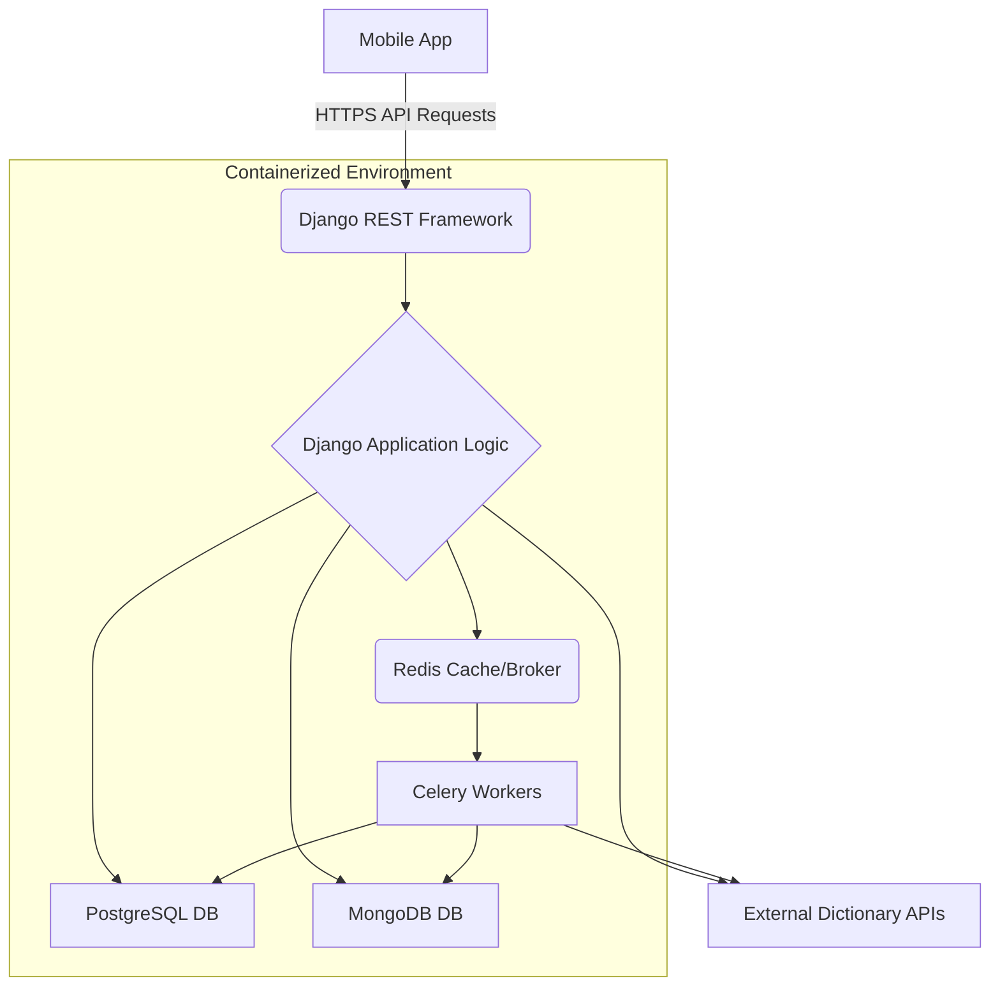

# System Patterns: AI-Powered Language Learning Backend

This document outlines the high-level architectural patterns, key design decisions, and core component interactions that define the structure of the AI-Powered Language Learning Backend.

---

## 1. Overall System Architecture

The system employs a **modular, API-driven backend architecture** built on Django. It integrates multiple specialized data stores and services to handle diverse data types and asynchronous operations, all containerized for consistent deployment.

- **API Layer (Django REST Framework):** Serves as the primary interface for the mobile application. Handles user requests, authentication, and orchestrates data access.
- **Application Logic (Django Apps):** Organizes business logic into distinct, loosely coupled Django applications (e.g., `users`, `dictionaries`, `learning`) representing domain features.
- **Dual Data Storage Strategy:**
  - **PostgreSQL:** Utilized for relational data, including user profiles, authentication data, learning progress metrics, and structured word metadata where strong schema enforcement and transactional integrity are crucial.
  - **MongoDB:** Employed as a flexible document store for the dynamic and evolving nature of AI-optimized word content, raw dictionary entries, and potentially rich media associated with words.
- **Asynchronous Processing (Celery & Redis):** Offloads computationally intensive tasks (e.g., AI optimization of words, bulk data imports, scheduled FSRS calculations) from the request-response cycle to background workers. Redis acts as the message broker for Celery and also as a caching layer.
- **Containerization (Docker):** The entire backend application, including database services and Redis/Celery, runs within Docker containers, ensuring environment parity from development to production.

